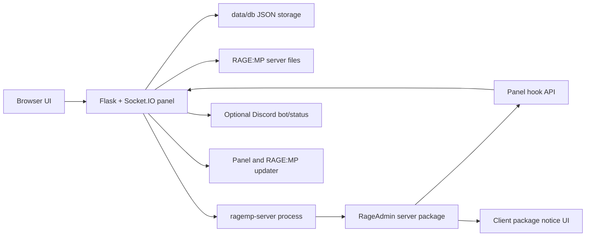

<div align="center">
  

  <h1>RageAdmin</h1>

  <p><strong>Web control panel for RAGE:MP servers, built around a local JSON storage backend.</strong></p>

  <p>
    Start the server, watch the console, edit files, manage players, schedule restarts,
    sync an in-game bridge package, and keep panel/RAGE:MP updates in one browser UI.
  </p>

  <p>
    
    
    
    
    <a href="./egg-rageadmin-ragemp.json"></a>
  </p>

  <p>
    <a href="#what-it-does">What It Does</a>
    <span>&nbsp;/&nbsp;</span>
    <a href="#quick-start">Quick Start</a>
    <span>&nbsp;/&nbsp;</span>
    <a href="#first-run">First Run</a>
    <span>&nbsp;/&nbsp;</span>
    <a href="#pterodactyl">Pterodactyl</a>
    <span>&nbsp;/&nbsp;</span>
    <a href="#configuration">Configuration</a>
    <span>&nbsp;/&nbsp;</span>
    <a href="#troubleshooting">Troubleshooting</a>
  </p>
</div>

---

> [!IMPORTANT]
> RageAdmin currently targets Linux `x86_64` / `amd64` RAGE:MP server deployments. The panel code may start elsewhere for development, but the bundled automatic RAGE:MP server install uses the official Linux x64 archive.

> [!NOTE]
> RageAdmin does **not** need MySQL, MariaDB, SQLite, Redis, or MongoDB. Runtime data is stored in local JSON files under `data/db/`.

## What It Does

RageAdmin is a browser-based operations panel for a RAGE:MP server. It combines process control, live console access, file management, player moderation, restart scheduling, Discord status tools, and an in-game bridge package.

<table>
  <tr>
    <td width="33%" valign="top">
      <strong>Run the Server</strong><br />
      Start, stop, restart, auto-start, track uptime, see live stats, and schedule daily or quick restarts.
    </td>
    <td width="33%" valign="top">
      <strong>Operate Faster</strong><br />
      Use the live console, send commands, edit <code>conf.json</code>, manage files, and maintain runtime content.
    </td>
    <td width="33%" valign="top">
      <strong>Moderate Players</strong><br />
      Track profiles, warnings, notes, bans, kicks, direct messages, broadcast notices, and saved identifiers.
    </td>
  </tr>
</table>

## System Map



## Feature Matrix

| Area | Included |
| --- | --- |
| Server lifecycle | Start, stop, restart, auto-start, process detection, uptime, CPU/RAM samples |
| Console | Live output, history, command input, command logging |
| Setup | PIN-protected first run, admin account creation, RAGE:MP Linux archive download |
| Storage | Local `data/db/*.json` files with legacy JSON migration |
| RAGE:MP config | Visual management for `conf.json` fields |
| Files | Browse, read, edit, upload, download, rename, delete, zip, unzip, create folders |
| Players | Online list, saved profiles, identifiers, playtime, notes, warnings, kick, ban |
| In-game bridge | Player sync, heartbeat, pending moderation actions, direct/broadcast UI notices |
| Users | Admin/user roles, per-user permissions, forced password change, avatars |
| Logs | Per-user action logs and console action tracking |
| Discord | Optional bot token, warning channel, customizable status embed JSON |
| Updates | Panel update checks from GitHub and RAGE:MP server archive metadata checks |
| Pterodactyl | Ready-to-import egg with portable Node.js and configurable NPM packages |

## Requirements

| Requirement | Notes |
| --- | --- |
| OS | Linux deployment recommended, Ubuntu 22.04/24.04 tested target |
| Architecture | `x86_64` / `amd64` |
| Python | `3.9+` |
| Python packages | Installed from [`requirements.txt`](./requirements.txt) |
| Tools | `git`, `python3`, `python3-venv`, `python3-pip` |
| Network | Needed during first setup to download the RAGE:MP Linux server archive |
| Database server | Not needed |

Recommended stack:

| Component | Recommendation |
| --- | --- |
| OS | Ubuntu 24.04 LTS |
| Python | Python 3.11+ |
| Reverse proxy | Nginx or another proxy with WebSocket support |
| Service manager | `systemd` |
| Storage backup | Back up `data/db/`, `data/logs/`, `panel_version.json`, and RAGE:MP server files |

## Quick Start

```bash
sudo apt update
sudo apt install -y git python3 python3-venv python3-pip

git clone https://github.com/zuraxscripts/RageAdmin.git
cd RageAdmin

python3 -m venv .venv
source .venv/bin/activate

pip install --upgrade pip
pip install -r requirements.txt

python3 main.py --port 20000
```

Open the panel:

```text
http://YOUR_SERVER_IP:20000
```

## First Run

The first launch is protected by a setup PIN printed in the console.

Setup asks for:

1. Setup PIN from the terminal
2. Admin username
3. Admin password

Setup then performs:

| Step | Result |
| --- | --- |
| Storage | Creates local JSON storage in `data/db/` |
| Secret | Generates the panel bridge secret if still using the default |
| Server files | Downloads the official RAGE:MP Linux x64 archive when missing |
| Runtime files | Ensures `packages/`, `client_packages/`, `maps/`, `plugins/`, and `conf.json` exist |
| Bridge | Installs `packages/rageadmin` and `client_packages/rageadmin` |
| User | Creates the first admin account |

Default paths:

| Item | Value |
| --- | --- |
| Panel port | `20000` |
| Server executable | `./RageMP-Server/ragemp-srv/ragemp-server` |
| Server directory | `./RageMP-Server/ragemp-srv/` |
| Panel storage | `./data/db/*.json` |
| Logs | `./data/logs/` |

## Storage Layout

RageAdmin uses small JSON files instead of an external database server.

| File | Purpose |
| --- | --- |
| `data/db/users.json` | Panel users, password hashes, roles, permissions |
| `data/db/server.json` | RAGE:MP executable path, log path, restart/update metadata |
| `data/db/panel.json` | Panel name, locale, port, secret, scheduled restarts, Discord settings |
| `data/db/bans.json` | Stored bans |
| `data/db/player_profiles.json` | Player profiles, identifiers, notes, warnings, history |
| `data/db/stats_history.json` | Runtime chart samples |

Legacy files such as `data/users.json`, `data/config.json`, `data/bans.json`, `data/player_profiles.json`, and root `panel_config.json` are migrated into `data/db/` when possible.

## Ubuntu Service

Create a dedicated user:

```bash
sudo useradd -r -m -s /usr/sbin/nologin rageadmin
```

Install the app:

```bash
sudo mkdir -p /opt/rageadmin
sudo chown -R rageadmin:rageadmin /opt/rageadmin
sudo -u rageadmin git clone https://github.com/zuraxscripts/RageAdmin.git /opt/rageadmin/app
sudo -u rageadmin python3 -m venv /opt/rageadmin/app/.venv
sudo -u rageadmin /opt/rageadmin/app/.venv/bin/pip install --upgrade pip
sudo -u rageadmin /opt/rageadmin/app/.venv/bin/pip install -r /opt/rageadmin/app/requirements.txt
```

Create `/etc/systemd/system/rageadmin.service`:

```ini
[Unit]
Description=RageAdmin
After=network.target

[Service]
Type=simple
User=rageadmin
Group=rageadmin
WorkingDirectory=/opt/rageadmin/app
Environment=PANEL_PORT=20000
ExecStart=/opt/rageadmin/app/.venv/bin/python /opt/rageadmin/app/main.py --port 20000
Restart=always
RestartSec=5

[Install]
WantedBy=multi-user.target
```

Enable it:

```bash
sudo systemctl daemon-reload
sudo systemctl enable --now rageadmin
sudo systemctl status rageadmin
```

Follow logs:

```bash
journalctl -u rageadmin -f
```

## Nginx Reverse Proxy

RageAdmin uses Socket.IO, so the proxy must pass WebSocket upgrade headers.

```nginx
server {
    listen 80;
    server_name panel.example.com;

    location / {
        proxy_pass http://127.0.0.1:20000;
        proxy_http_version 1.1;
        proxy_set_header Host $host;
        proxy_set_header X-Real-IP $remote_addr;
        proxy_set_header X-Forwarded-For $proxy_add_x_forwarded_for;
        proxy_set_header X-Forwarded-Proto $scheme;
        proxy_set_header Upgrade $http_upgrade;
        proxy_set_header Connection "upgrade";
    }
}
```

Useful environment flags behind HTTPS:

```bash
PANEL_FORCE_HTTPS=true
PANEL_SESSION_COOKIE_SECURE=true
```

## Pterodactyl

Use the included egg when deploying through Pterodactyl:

| File | Purpose |
| --- | --- |
| [`egg-rageadmin-ragemp.json`](./egg-rageadmin-ragemp.json) | Ready-to-import Pterodactyl egg |

The egg does the following:

| Step | Details |
| --- | --- |
| Clone | Clones this repository from `GIT_REPO_URL` and `GIT_BRANCH` |
| Node.js | Installs portable Node.js from `NODEJS_VERSION` |
| Startup | Creates `/home/container/start-rageadmin.sh` |
| Ports | Keeps RAGE:MP game, transfer, and panel ports separated |
| Config sync | Writes `conf.json` port/bind values from allocations |
| NPM packages | Optionally runs `npm install` for `NPM_PACKAGES` inside the RAGE:MP server dir |
| Panel | Starts `python3 main.py --port "$PANEL_PORT"` |

Required allocations:

| Allocation | Meaning |
| --- | --- |
| `SERVER_PORT` | RAGE:MP game port |
| `SERVER_PORT + 1` | RAGE:MP transfer/HTTP port |
| `PANEL_PORT` | RageAdmin web panel port |

Important Pterodactyl notes:

| Topic | Note |
| --- | --- |
| Third allocation | `PANEL_PORT` must not equal `SERVER_PORT` or `SERVER_PORT + 1` |
| External database | Not required |
| Architecture | Use Linux `amd64` / `x86_64` nodes |
| Internet | First setup needs outbound access for RAGE:MP files |
| NPM packages | Leave `NPM_PACKAGES` empty unless your gamemode needs extra Node packages |

## Configuration

### CLI and Environment

```bash
python3 main.py --port 20000
```

The panel port can also come from environment variables:

```bash
PANEL_PORT=20000 python3 main.py
PORT=20000 python3 main.py
```

Runtime environment variables:

| Variable | Default | Purpose |
| --- | --- | --- |
| `PANEL_PORT` | `20000` | Preferred panel HTTP port |
| `PORT` | `20000` | Fallback panel HTTP port |
| `PANEL_PRODUCTION` | `true` | Enables production defaults |
| `PANEL_ACCESS_LOGS` | `false` in production | Controls HTTP access logging |
| `PANEL_FORCE_HTTPS` | `false` | Redirects HTTP to HTTPS when enabled |
| `PANEL_SESSION_COOKIE_SECURE` | follows HTTPS flag | Marks session cookie secure |
| `PANEL_SOCKETIO_ASYNC_MODE` | auto/threading | Forces Socket.IO async backend |
| `HPM_UPDATE_CONFIG_URL` | empty | Optional remote update config JSON |
| `HPM_PANEL_REPO` | `zuraxscripts/RageAdmin` | GitHub repo used for panel update checks |
| `HPM_RAGEMP_SERVER_URL` | official RAGE:MP Linux archive | Server archive URL override |
| `HPM_UPDATE_INTERVAL_MINUTES` | config/default | Background update check interval |

### Repository Files

| Path | Purpose |
| --- | --- |
| [`main.py`](./main.py) | Launcher, dependency check, child process supervision |
| [`server_manager.py`](./server_manager.py) | Flask/Socket.IO panel, routes, setup, server control |
| [`storage.py`](./storage.py) | JSON storage layer and legacy migration |
| [`updater.py`](./updater.py) | Panel and RAGE:MP updater worker |
| [`requirements.txt`](./requirements.txt) | Python dependencies |
| [`panel_version.json`](./panel_version.json) | Current panel version |
| [`update_config.json`](./update_config.json) | Default update sources |
| [`egg-rageadmin-ragemp.json`](./egg-rageadmin-ragemp.json) | Pterodactyl egg |
| [`templates/`](./templates) | Panel pages and UI assets |
| [`locales/`](./locales) | English and Czech translations |
| [`package_templates/`](./package_templates) | RAGE:MP bridge package templates |

## In-Game Bridge

During setup, RageAdmin installs a server-side and client-side RAGE:MP package:

| Package | Installed to | Purpose |
| --- | --- | --- |
| Server bridge | `RageMP-Server/ragemp-srv/packages/rageadmin` | Sends player sync, heartbeat, identifiers, and receives pending actions |
| Client notice UI | `RageMP-Server/ragemp-srv/client_packages/rageadmin` | Shows admin messages, warnings, broadcasts, and restart notices in-game |

The bridge uses a generated `panelSecret` stored in `data/db/panel.json` and mirrored into `packages/rageadmin/config.json`.

## Updating

RageAdmin can check and apply updates for:

| Target | Source |
| --- | --- |
| Panel | GitHub repository from `update_config.json` or `HPM_PANEL_REPO` |
| RAGE:MP server files | Archive URL from `update_config.json` or `HPM_RAGEMP_SERVER_URL` |

The updater stores state in:

| File | Purpose |
| --- | --- |
| `data/update_status.json` | Last update check/apply state |
| `data/update_job.json` | Active updater job definition |
| `data/update.log` | Updater log output |

## Backups

Before updates or server maintenance, back up at least:

```text
data/db/
data/logs/
RageMP-Server/ragemp-srv/conf.json
RageMP-Server/ragemp-srv/packages/
RageMP-Server/ragemp-srv/client_packages/
RageMP-Server/ragemp-srv/maps/
RageMP-Server/ragemp-srv/plugins/
```

## Security Notes

| Area | Recommendation |
| --- | --- |
| Admin account | Use a strong password and keep admin users limited |
| Public exposure | Put the panel behind firewall rules or a reverse proxy |
| HTTPS | Use HTTPS when the panel is reachable over the internet |
| Panel secret | Do not publish `data/db/panel.json` or `packages/rageadmin/config.json` |
| Backups | Treat `data/db/users.json` as sensitive because it contains password hashes |
| Permissions | Give non-admin users only the permissions they need |

## Troubleshooting

### Panel does not open

Check whether the process is listening:

```bash
ss -tulpn | grep 20000
```

Check service logs if using systemd:

```bash
journalctl -u rageadmin -f
```

### Setup PIN is missing

Restart the panel and watch the terminal output. The setup PIN is printed while setup is still required.

### Storage files are missing

Start the panel once, or create them through setup. RageAdmin creates these automatically:

```text
data/db/users.json
data/db/server.json
data/db/panel.json
data/db/bans.json
data/db/player_profiles.json
data/db/stats_history.json
```

### Server executable is missing

The default path is:

```text
./RageMP-Server/ragemp-srv/ragemp-server
```

If the file is missing, rerun setup or check whether outbound downloads from `https://cdn.rage.mp/` are blocked.

### WebSocket/live console issues behind Nginx

Confirm the proxy passes these headers:

```nginx
proxy_set_header Upgrade $http_upgrade;
proxy_set_header Connection "upgrade";
```

### Pterodactyl panel opens but RAGE:MP port is wrong

Confirm that three allocations are assigned and that `PANEL_PORT` is separate from `SERVER_PORT` and `SERVER_PORT + 1`.

### MySQL/MariaDB setup guide is not here

That is intentional. RageAdmin stores its panel data in `data/db/*.json` and does not connect to a database server.

## License

No license file is currently included in this repository. Add one before publishing or redistributing builds publicly.
